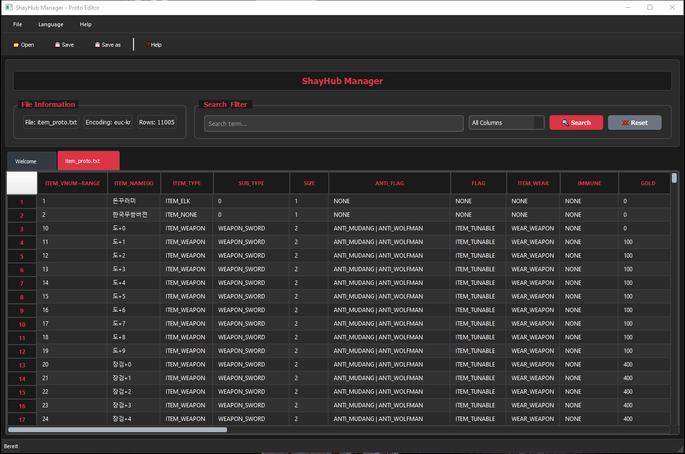

# ShayHub Manager - Proto Editor



> **Version 1.3.2** | Professional Proto Editor for Metin2 Servers

A modern, user-friendly tool for editing `item_proto.txt` and `mob_proto.txt` files with advanced features and optimized performance.

## 🚀 Key Features

### ⚡ **High Performance**
- **5x faster loading** of large proto files (2.3MB in <2 seconds)
- **Smart batch processing** for better responsiveness
- **Progress dialogs** for large files with live progress tracking

### 🎨 **Enhanced User Experience**
- **Larger, clearer fonts** (12px Segoe UI)
- **Smart column sizing** (Names 150px, IDs 80px)
- **Comfortable edit dialogs** on double-click
- **Improved hover effects** and visual indicators

### 🌏 **Optimized for Metin2**
- **EUC-KR as default encoding** for Korean proto files
- **Automatic encoding detection** with Metin2 priority
- **Robust error handling** for problematic characters

### 🌍 **Multi-Language Support**
- **German/English** interface switching
- **Complete UI translation** for international users
- **Language preference** saved automatically

---

## 📋 Feature Overview

### ✅ **Core Features**
- 📂 **File Support**: `item_proto.txt`, `mob_proto.txt`
- 📊 **Excel-like table** with sorting and filtering
- 🔍 **Advanced search** across all columns or specific fields
- ✏️ **Inline editing** with large edit dialogs
- 💾 **Safe saving** with automatic backups

### 🌍 **Encoding Support**
- 🇰🇷 **EUC-KR** (Standard for Metin2)
- 🇰🇷 **CP949** (Korean Windows)
- 🌐 **UTF-8, UTF-16LE** (Universal)
- 🔧 **Automatic detection** with smart fallbacks

### 🎯 **Editing & Navigation**
- ➕ **Add/delete rows** with confirmation
- 📋 **Duplicate rows** via context menu
- 📝 **Copy/paste** cell contents
- 🔍 **Quick search** with real-time filtering
- ⌨️ **Keyboard shortcuts** for common actions

### 🎨 **Professional Design**
- 🌙 **Dark theme** with black/red color scheme
- 📱 **Responsive interface** for different screen sizes
- 🎯 **User-friendly navigation** with clear icons
- 💡 **Contextual help** and tooltips

---

## 🛠️ Installation & Usage

### **Easy Installation**
1. **Download** the latest release from GitHub
2. **Extract** the ZIP file to your desired location
3. **Run** `ShayHub_Manager.exe` - that's it!

### **System Requirements**
- Windows 10/11
- 4GB RAM (recommended for large files)
- No Python installation required

---

## 📖 How to Use

### **1. Open File**
- 📂 Click **"Open"** button in toolbar
- 🎯 **Automatic encoding detection**
- ⚡ **Fast loading** with progress display

### **2. Edit Data**
- 🖱️ **Double-click** for large edit dialog
- ✏️ **Inline editing** directly in table
- 📋 **Right-click** for context menu options

### **3. Search & Filter**
- 🔍 **Search field** for real-time filtering
- 📊 **Column-specific search**
- ❌ **Clear filter** button

### **4. Save**
- 💾 **Save** with original encoding
- 📝 **Save as** with encoding selection
- 🔒 **Automatic backups** (.backup files)

---

## 🔧 Advanced Features

### **Row Operations**
- **Add new rows** with empty template
- **Delete rows** with confirmation dialog
- **Duplicate rows** for quick templating
- **Copy/paste** entire rows (Ctrl+C/Ctrl+V)

### **Search & Filter**
- **Real-time search** across all data
- **Column-specific filtering**
- **Case-insensitive search**
- **Instant filter clearing**

### **Data Safety**
- ✅ **Automatic backups** before saving
- ✅ **Data validation** on input
- ✅ **Error recovery** for encoding issues
- ✅ **Transactional saving** without data loss

---

## 📊 Supported File Formats

### **Proto Files**
| File | Description | Encoding |
|------|-------------|----------|
| `item_proto.txt` | Item definitions | EUC-KR |
| `mob_proto.txt` | Monster definitions | EUC-KR |

---

## 🐛 Troubleshooting

### **Common Issues**

**Problem**: Encoding errors when loading
```
Solution: Tool detects EUC-KR automatically.
If not: File > Open > Select encoding
```

**Problem**: Slow loading of large files
```
Solution: v1.3.2 is 5x faster!
Progress dialog shows loading status.
```

**Problem**: Text too small/unreadable
```
Solution: v1.3.2 has larger fonts (12px).
Columns auto-resize intelligently.
```

### **Log Files**
```bash
# Logs are located in:
logs/shayhub_manager.log
```

---

## 🚧 Roadmap

### **v1.4.0** *(planned)*
- 🗄️ **SQL Export/Import** functionality
- 🔍 **Advanced search** with regex support
- 📊 **Statistics** about proto files
- 🎨 **Custom themes** (Light/Dark/Color schemes)

### **v1.5.0** *(planned)*
- 🔗 **Plugin system** for extensions
- 📈 **Performance monitoring**
- 🌐 **More languages** (Korean, Spanish, French)
- 📱 **Tablet optimization** for touch devices

---

## 👥 Support & Development

### **Developed for**
🏢 **ShayHub** - Professional Metin2 Server Tools

### **Technology Stack**
- 🐍 **Python 3.13**
- 🖼️ **PyQt5** (GUI Framework)
- 📊 **Pandas** (Data Processing)
- 🔤 **Chardet** (Encoding Detection)

### **License**
📄 **MIT License** - See [LICENSE.md](LICENSE.md) for details

---

## 📝 Changelog

See [CHANGELOG.md](CHANGELOG.md) for detailed version history.

**Current Version**: v1.3.2
- 🐛 Fixed row deletion with active search filters
- 🐛 Fixed duplicate row function with filtered data
- 🔧 Improved row operations in filtered views
- 📝 Enhanced logging for debugging

---

## 🔗 Links

- 🐛 **Report Issues**: [GitHub Issues](https://github.com/your-repo/issues)
- 💬 **Discord Support**: [Join our Discord](https://discord.gg/7aum2ZfmU3)
- 📧 **Contact**: support@shayhub.com

---

*ShayHub Manager - Making Metin2 proto editing simple and efficient.* 